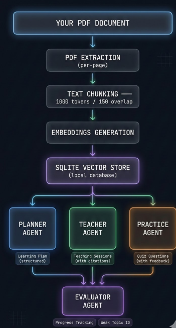
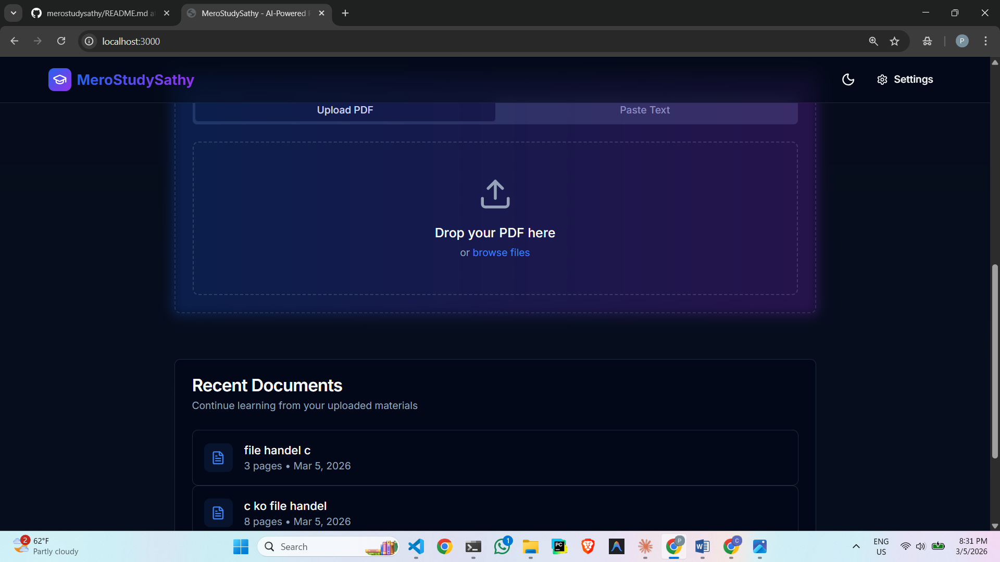

# MeroStudySathy

Local-first AI tutor for PDFs and pasted text. Upload a document, generate a learning plan, study in chat mode, and track progress with persistent local data.

## Screenshots

Add your screenshots to the `images/` folder using these exact names:

1. Basic UI: `images/basic-ui.png`
2. Learning Pipeline: `images/pipeline.png`
3. Upload Section: `images/upload-section.png`
4. Saved/Uploaded PDFs: `images/saved-uploaded-pdfs.png`
5. Study Plan View: `images/study-plan-inside.png`
6. LLM Settings Form: `images/llm-settings.png`

README image links (already wired):






## Features

- Upload PDF files or paste raw text
- Extract text and chunk content for retrieval
- Generate embeddings and store vectors in local SQLite
- Generate and save learning plans per document
- Reuse indexed embeddings on revisits (no unnecessary re-indexing)
- Teach each part in chat with Markdown-rendered output
- Save generated lesson content per part for fast reuse
- Reopen and read previously generated lessons even without API key (offline reuse for saved lessons)
- Mask API keys in UI while storing encrypted values locally
- Manual part completion toggle (check/uncheck parts)
- Progress tracking panel using persisted completion/weak topics/quiz history
- `next` command in chat to jump to next study part
- Provider fallback logic for Gemini model/embedding compatibility

## Tech stack

- Next.js 14 (App Router)
- TypeScript + React 18
- Tailwind CSS + shadcn/ui components
- SQLite (`better-sqlite3`) for local storage
- `pdf-parse` for PDF extraction
- `react-markdown` + `remark-gfm` for lesson rendering
- OpenAI / Gemini / Claude via provider abstraction

## Quick start

### 1. Install

```bash
npm install
```

### 2. Run locally

```bash
npm run dev
```

Open `http://localhost:3000`.

### 3. Configure provider in Settings

Set:

- Provider: `openai` | `gemini` | `claude`
- Model name (chat model)
- API key
- Embedding model (optional)

Notes:

- API keys are encrypted locally.
- Masked key preview is shown after save.
- For Gemini, use a chat model that supports `generateContent` and embedding model that supports `embedContent`.

### 4. How to fill LLM key/settings (example)

Open `/settings` and fill fields like this:

- If using `Google Gemini`:
  - API Key: your Gemini API key from Google AI Studio
  - Model Name: `gemini-2.5-flash` (or `gemini-2.0-flash`)
  - Embedding Model: `text-embedding-004` (fallback: `gemini-embedding-001`)
- If using `OpenAI`:
  - API Key: your OpenAI key
  - Model Name: `gpt-4o-mini`
  - Embedding Model: `text-embedding-3-small`
- If using `Claude`:
  - API Key: your Anthropic key
  - Model Name: `claude-3-5-sonnet-20240620`
  - Embeddings are not supported in this app for Claude

After entering values, click **Save Configuration**.
If a key is already configured, leave API key blank to keep current key.

## Expected usage flow

1. Upload a PDF (or paste text).
2. Open the document page.
3. Click **Generate Plan** (indexes + plan generation).
4. Select a part and study in chat.
5. Type `next` to move to the next plan part.
6. Toggle completion circles in the sidebar to mark progress.

## Scripts

```bash
npm run dev    # start dev server
npm run lint   # run Next.js ESLint
npm run build  # production build
npm run start  # run production server
```

## Project structure

```txt
app/
  api/
    docs/
    evaluate/
    plan/
    practice/
    settings/
    teach/
  doc/[id]/
  settings/
components/
lib/
  agents/
  llm/
  pdf/
  rag/
  storage/
images/
docs/
data/          # local runtime data (gitignored)
```

## API routes (implemented)

- `GET /api/settings`
- `POST /api/settings`
- `DELETE /api/settings`
- `GET /api/docs`
- `POST /api/docs/upload`
- `POST /api/docs/[id]/index`
- `GET /api/docs/[id]/plan`
- `POST /api/docs/[id]/plan`
- `GET /api/docs/[id]/progress`
- `POST /api/docs/[id]/progress`
- `POST /api/teach` (lesson generation + cached lesson reuse)
- `POST /api/practice`
- `POST /api/evaluate`
- `POST /api/plan`

## Local data and privacy

- Database: `data/tutor.db`
- Uploaded files and extracted text: `data/uploads/`
- Encrypted settings and API keys: `settings` table
- Persisted plan data: `learning_plans` table
- Persisted lesson output: `lesson_content` table

No telemetry or external backend is used by this project. External requests are only made to your selected LLM provider APIs.

## Troubleshooting

- `Cannot find module './xxx.js'` in Next dev:
  - clear cache and restart:
  - `rmdir /s /q .next` (cmd) or `Remove-Item -Recurse -Force .next` (PowerShell)
- Indexing fails for Gemini:
  - verify model supports `generateContent` and embedding model supports `embedContent`
  - verify key/project quota and API availability
- Plan shows but lesson area is blank:
  - restart dev server after dependency updates

## Documentation

- `docs/architecture.md`
- `docs/api-reference.md`
- `docs/development.md`

## License

MIT
