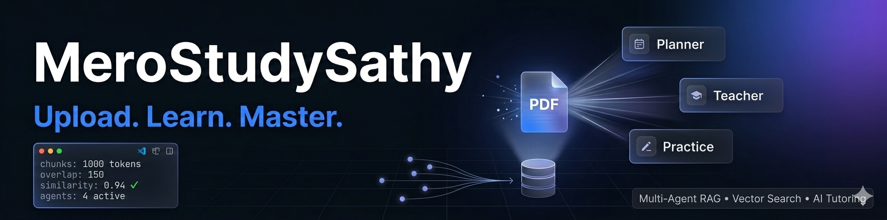
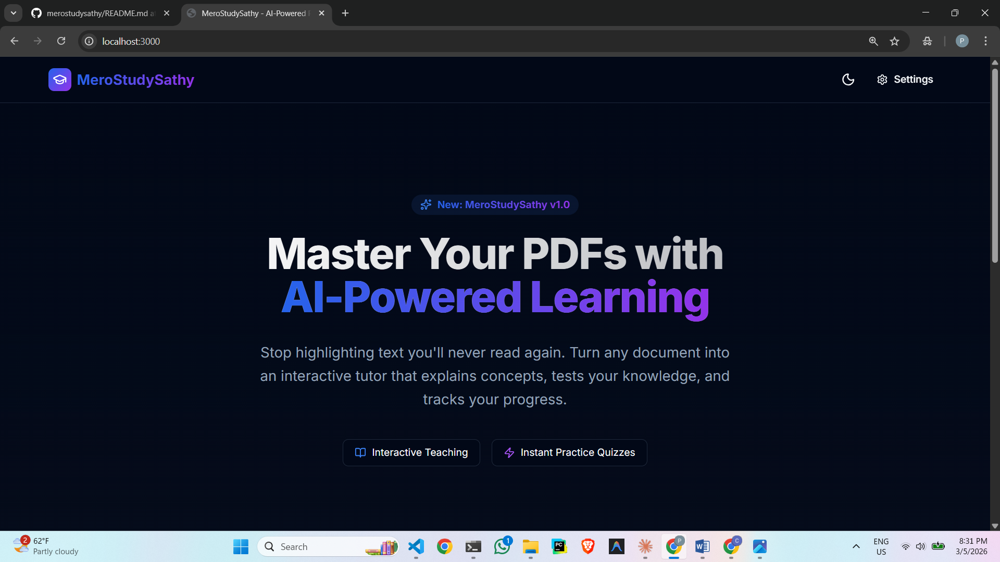
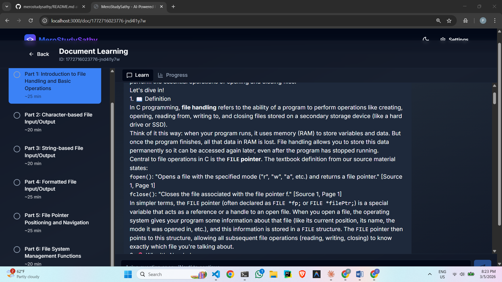

<div align="center">

# 📚 MeroStudySathy

### An intelligent multi-agent PDF tutor that actually teaches you — not just highlights text you'll never read again.

[](https://nextjs.org/)
[](https://www.typescriptlang.org/)
[](https://www.sqlite.org/)
[](LICENSE)



</div>

---

## 🎯 The Problem

Let's be honest — learning from PDFs sucks.

You download a 200-page technical manual with good intentions. Then what? You're on your own. No roadmap, no guidance, no feedback. Just you, a wall of text, and the creeping realization you have no idea where to start.

Traditional study methods are broken:

| Problem | Reality |
|--------|---------|
| **No structure** | Which chapter first? What's actually important? |
| **No interaction** | Reading is passive. Your brain checks out after page 3. |
| **No feedback** | Did you actually understand that? Who knows. |
| **No accountability** | Easy to skim, easier to forget. |

---

## ✅ The Solution

MeroStudySathy turns static PDFs into interactive learning experiences. Think of it as a patient tutor who actually read the material and knows how to teach it.



---

## 🚀 Quick Start

### Prerequisites

- Node.js 18 or higher
- An API key from OpenAI, Google AI, or Anthropic

### Installation

```bash
git clone https://github.com/parnish007/merostudysathy.git
cd merostudysathy
npm install
npm run dev
```

Open `http://localhost:3000`

### First-Time Setup

**1. Configure your LLM provider**

Go to Settings and choose your provider:

| Provider | Recommended Model |
|----------|------------------|
| OpenAI | `gpt-4-turbo-preview` or `gpt-3.5-turbo` |
| Google | `gemini-pro` or `gemini-1.5-pro` |
| Anthropic | `claude-3-opus-20240229` or `claude-3-sonnet-20240229` |

Your API key is encrypted with AES-256-CBC before local storage. The UI shows a masked value like `sk-1***9x2` — nobody else sees it.

**2. Upload a document**


Drag and drop any PDF or paste text directly. The system extracts text page-by-page and builds a searchable vector index automatically.

**3. View your saved documents**


All uploaded documents are stored locally. Click any to resume learning exactly where you left off — no re-processing needed.

**4. Generate a learning plan**

Hit **Generate Plan** and let the AI analyze your document. The Planner Agent reads through your content, identifies key concepts, and builds a structured learning path.



**5. Start an interactive session**

Click any section in your plan to begin. The Teacher Agent explains concepts using a proven 7-part structure with citations back to your document.


**6. Ask follow-up questions**

After each teaching session, ask anything — *"why does this work?"*, *"can you give me a simpler example?"*, *"how does this connect to chapter 2?"*. The agent answers from your document's context.

**7. Practice & get evaluated**

Switch to the Practice tab. Answer MCQ, short answer, and conceptual questions. Get detailed feedback and see exactly what you've mastered.

---

## ✨ Features

### Core Features

- **Multi-agent architecture** — Planner, Teacher, Practice, and Evaluator agents working together
- **Multi-provider LLM support** — OpenAI, Google Gemini, and Anthropic Claude
- **RAG pipeline** — PDF text → chunking → embeddings → SQLite vector store → cosine similarity retrieval
- **Streaming teaching sessions** — responses stream in real-time with source citations `[Source X, Page Y]`
- **Conversational follow-up** — ask questions about anything in the document after each session
- **Practice question generation** — MCQ, short answer, and conceptual "why" questions from your material
- **Answer evaluation with feedback** — scored 0-100 with detailed explanation of what you got right/wrong
- **Progress tracking** — see what you've mastered and what needs work
- **Weak topic identification** — system flags concepts you consistently struggle with

### Performance & Privacy

- **🔥 Response caching** — once a teaching session is generated for a section, it's saved locally forever. Revisiting the same section costs zero API credits — no re-generation, no burnout
- **🔒 Local-first** — everything runs on your machine. Documents, embeddings, API keys — nothing leaves your device
- **🔑 AES-256-CBC encryption** — API keys encrypted with machine-specific keys before storage
- **⚡ Batch embeddings** — generated in batches of 100 for efficiency
- **60–80% cost reduction** — through intelligent response caching on repeated queries

### UI & UX

- PDF viewer with navigation and zoom
- Dark mode
- Responsive design
- Masked API key display in settings

---

## 🏗️ System Architecture


```
┌─────────────────────────────────────────────────────────────────┐
│                         YOUR PDF DOCUMENT                        │
└────────────────────────────┬────────────────────────────────────┘
                             │
                             ▼
                    ┌────────────────┐
                    │ PDF EXTRACTION │
                    │  (per-page)    │
                    └────────┬───────┘
                             │
                             ▼
                    ┌────────────────┐
                    │ TEXT CHUNKING  │
                    │ 1000 tok/150   │
                    └────────┬───────┘
                             │
                             ▼
                    ┌────────────────┐
                    │   EMBEDDINGS   │
                    │  (batch: 100)  │
                    └────────┬───────┘
                             │
                             ▼
                ┌────────────────────────┐
                │  SQLITE VECTOR STORE   │  ←── Response Cache Layer
                │    (local database)    │       (0 API cost on repeat)
                └───────────┬────────────┘
                            │
        ┌───────────────────┼───────────────────┐
        │                   │                   │
        ▼                   ▼                   ▼
   ┌─────────┐        ┌─────────┐        ┌─────────┐
   │ PLANNER │        │ TEACHER │        │PRACTICE │
   │  AGENT  │        │  AGENT  │        │  AGENT  │
   └────┬────┘        └────┬────┘        └────┬────┘
        │                  │                   │
        ▼                  ▼                   ▼
   Learning Plan    Teaching Sessions    Quiz Questions
   (structured)     (with citations)     (with feedback)
        │                  │                   │
        └──────────────────┼───────────────────┘
                           │
                           ▼
                    ┌─────────────┐
                    │  EVALUATOR  │
                    │    AGENT    │
                    └──────┬──────┘
                           │
                           ▼
                  Progress Tracking
                  Weak Topic Identification
```

---

## 🔄 Data Flow Pipeline

<details>
<summary><strong>Upload Phase</strong></summary>

```
User uploads PDF
      │
      ├─→ Extract text per page (pdf-parse)
      ├─→ Store in /data/uploads/{id}.txt
      └─→ Create document record in SQLite
```
</details>

<details>
<summary><strong>Indexing Phase</strong></summary>

```
User clicks "Generate Plan"
      │
      ├─→ Chunk text (1000 tokens, 150 overlap) → store in SQLite
      ├─→ Generate embeddings (batch of 100) → store vectors in SQLite
      └─→ Analyze structure → Generate plan → store plan in SQLite
```
</details>

<details>
<summary><strong>Learning Phase</strong></summary>

```
User selects a section
      │
      ├─→ Check response cache (SQLite)
      │         ├─→ HIT  → return cached response (0 API cost)
      │         └─→ MISS → continue below
      │
      ├─→ Build query from section title
      ├─→ Vector search (top-5 chunks, cosine similarity)
      ├─→ Format context with page citations
      ├─→ Stream teaching response
      └─→ Save to cache → Display with [Source X, Page Y]
```
</details>

<details>
<summary><strong>Practice Phase</strong></summary>

```
User switches to Practice
      │
      ├─→ Retrieve chunks for topic
      ├─→ Generate questions (MCQ, Short Answer, Why)
      ├─→ User submits answer
      ├─→ Evaluate: Score (0-100) + Detailed feedback + Weak topic ID
      └─→ Update progress in SQLite
```
</details>

---

## 🧠 How the Teaching Works

Every lesson follows a **7-part structure** based on educational research:

| Step | What Happens |
|------|-------------|
| 1. **Definition** | What is this concept? |
| 2. **Why It Matters** | Real-world relevance |
| 3. **Core Theory** | How it actually works |
| 4. **Examples** | Concrete applications |
| 5. **Common Mistakes** | What to avoid |
| 6. **Recap** | Quick summary |
| 7. **Next Steps** | What's coming next |

Every response includes citations like `[Source 3, Page 12]` — you can verify everything against your original document.

---

## 🛠️ Tech Stack

| Layer | Technology |
|-------|-----------|
| Framework | Next.js 14 (App Router) |
| Language | TypeScript |
| Styling | Tailwind CSS + shadcn/ui |
| Database | SQLite (better-sqlite3) |
| Vector Store | SQLite (cosine similarity) |
| PDF Processing | pdf-parse |
| LLM Integration | OpenAI / Gemini / Claude APIs |
| Caching | SQLite response cache |
| Encryption | AES-256-CBC |

---

## 📁 Project Structure

```
merostudysathy/
├── app/
│   ├── page.tsx              # Home / upload page
│   ├── settings/             # API key configuration
│   ├── doc/[id]/             # Learning interface
│   └── api/                  # API routes
├── components/
│   ├── ui/                   # shadcn/ui components
│   └── *.tsx                 # Custom components
├── lib/
│   ├── agents/               # Planner, Teacher, Practice, Evaluator
│   ├── llm/                  # Multi-provider LLM clients
│   ├── rag/                  # Chunking, embeddings, vector search
│   ├── storage/              # SQLite DB + response cache
│   └── pdf/                  # PDF extraction
├── images/                   # README screenshots
├── docs/
│   ├── architecture.md
│   ├── api-reference.md
│   └── development.md
└── data/                     # Local data — gitignored
    ├── tutor.db              # SQLite database
    └── uploads/              # Uploaded files
```

---

## 🔒 Privacy & Security

Everything stays on your machine:

- 📄 Documents stored in local `/data` folder
- 🔑 API keys encrypted with AES-256-CBC + machine-specific keys
- 🗄️ Vector embeddings in local SQLite database
- 💾 Response cache in local SQLite — no repeated API calls
- 🚫 No external servers, no data collection, no telemetry

Delete the `/data` folder and everything's gone. Simple as that.

---

## 🗺️ Roadmap

- [x] Multi-agent RAG pipeline (Planner, Teacher, Practice, Evaluator)
- [x] Multi-provider LLM support
- [x] Response caching (zero repeat API cost)
- [x] Conversational follow-up chat per section
- [x] Progress tracking + weak topic identification
- [x] AES-256 encrypted local key storage
- [ ] RAPTOR tree indexing for hierarchical retrieval
- [ ] Spaced repetition scheduling
- [ ] Local LLM support (Ollama)
- [ ] Collaborative learning features
- [ ] Mobile app

---

## 🤝 Contributing

This started as a personal project to solve my own learning problems. If you find it useful and want to contribute, open an issue or submit a PR.

---

## 📄 License

MIT — use it however you want.

---

<div align="center">

Built by [Trilochan Sharma](https://github.com/parnish007) • [Portfolio](https://parnish-aka-trilochan.vercel.app/) • [LinkedIn](https://linkedin.com/in/trilochan-sharma-995851370/)

⭐ Star this repo if it helped you learn something!

</div>
